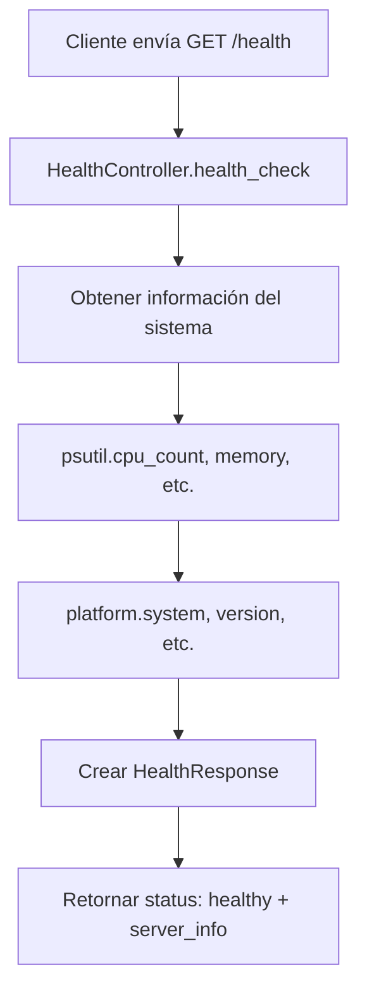
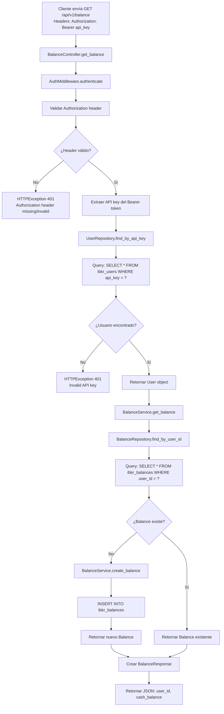
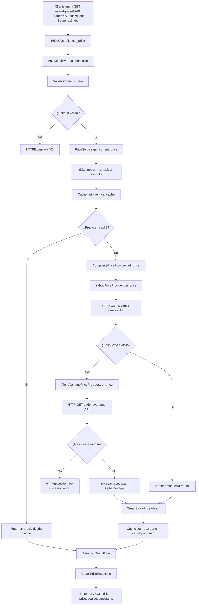
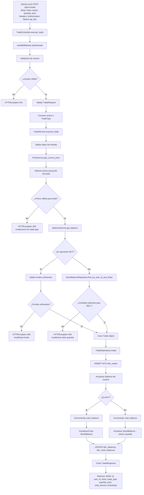
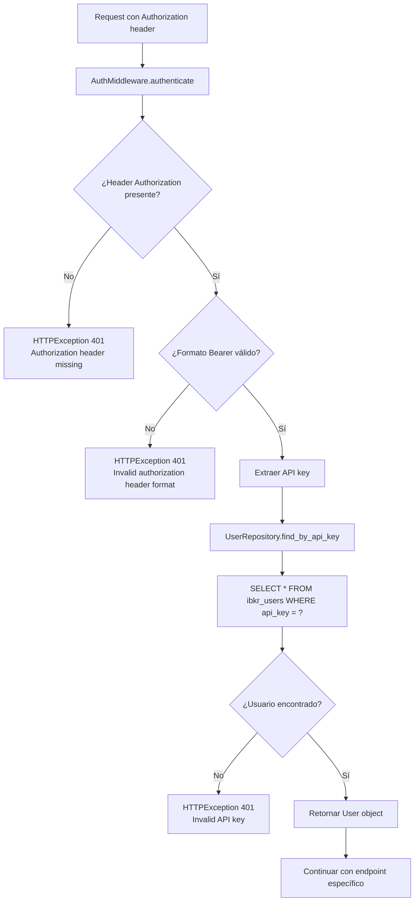
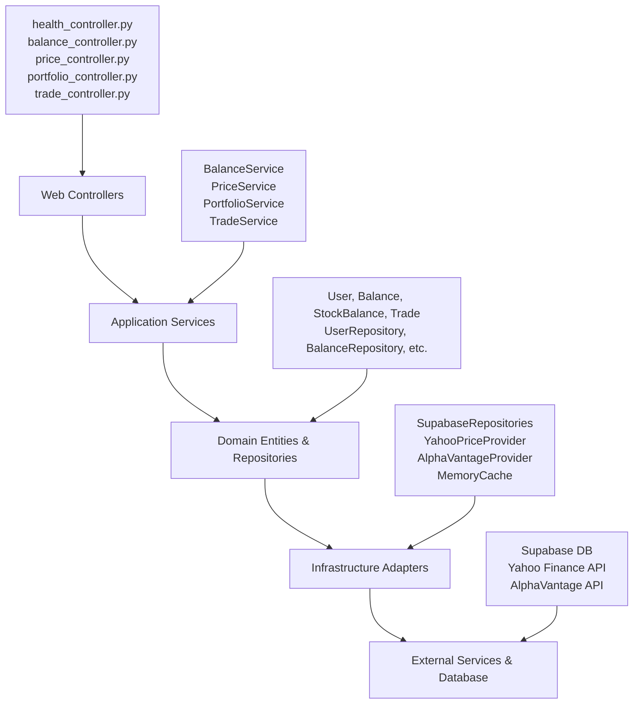

# Diagramas de Flujo - Endpoints API IBKR

## 1. GET /health - Health Check



**Características:**
- ✅ Sin autenticación requerida
- ✅ Sin acceso a base de datos
- ✅ Información en tiempo real del servidor

---

## 2. GET /api/v1/balance - Obtener Balance del Usuario



**Características:**
- 🔐 Requiere autenticación con API key
- 💾 Acceso a tablas: `ibkr_users`, `ibkr_balances`
- 🔄 Auto-creación de balance si no existe

---

## 3. GET /api/v1/price/{ticker} - Obtener Precio de Acción



**Características:**
- 🔐 Requiere autenticación con API key
- 📊 Fuentes de datos: Yahoo Finance (primario), AlphaVantage (respaldo)
- ⚡ Caché en memoria con TTL de 3 minutos
- 🔄 Sistema de fallback entre proveedores

---

## 4. GET /api/v1/portfolio - Obtener Portafolio del Usuario

```mermaid
flowchart TD
    A[Cliente envía GET /api/v1/portfolio<br/>Headers: Authorization: Bearer api_key] --> B[PortfolioController.get_portfolio]
    B --> C[AuthMiddleware.authenticate]
    C --> D[Validación de usuario]
    D --> E{¿Usuario válido?}
    E -->|No| F[HTTPException 401]
    E -->|Sí| G[PortfolioService.get_portfolio]
    G --> H[StockBalanceRepository.find_by_user_id]
    H --> I[Query: SELECT * FROM ibkr_stock_balances WHERE user_id = ?]
    I --> J[Retornar List[StockBalance]]
    J --> K[Mapear a StockHolding objects]
    K --> L[Crear PortfolioResponse]
    L --> M[Retornar JSON: user_id, holdings[]]
```

**Características:**
- 🔐 Requiere autenticación con API key
- 💾 Acceso a tablas: `ibkr_users`, `ibkr_stock_balances`
- 📈 Lista todas las posiciones de acciones del usuario

---

## 5. POST /api/v1/trade - Ejecutar Operación de Trading



**Características:**
- 🔐 Requiere autenticación con API key
- 💾 Acceso a tablas: `ibkr_users`, `ibkr_balances`, `ibkr_stock_balances`, `ibkr_trades`
- ✅ Validaciones de precios contra mercado
- ✅ Validaciones de fondos y cantidades disponibles
- 🔄 Actualizaciones atómicas de balances y posiciones
- 📊 Soporte para operaciones BUY y SELL

---

## Flujo de Autenticación (Común a todos excepto /health)



## Arquitectura de Capas



Este diagrama muestra el flujo completo de datos para cada endpoint del sistema IBKR, desde la recepción de la request hasta la respuesta final, incluyendo todas las validaciones, accesos a base de datos y servicios externos involucrados.